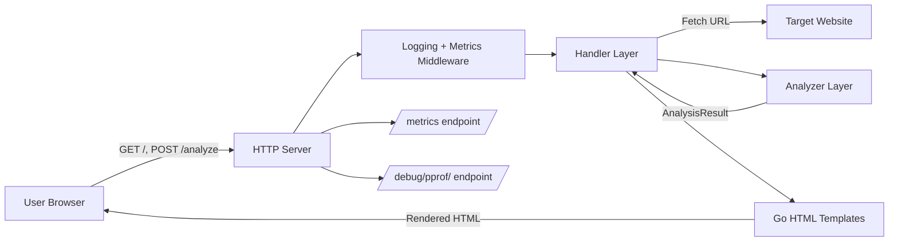
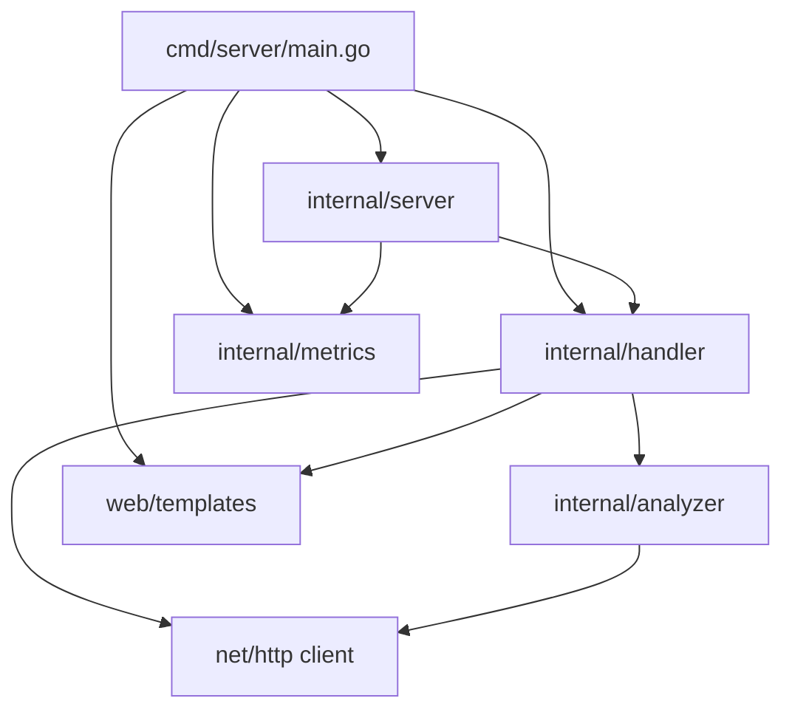
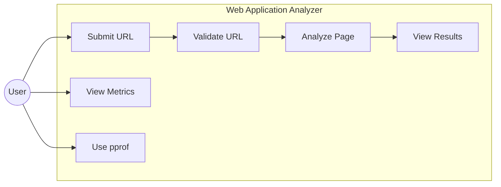
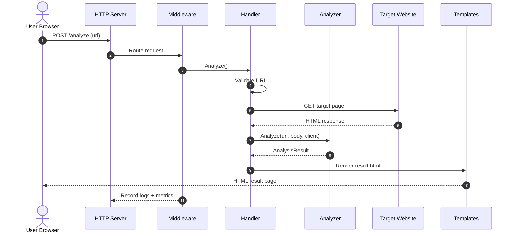
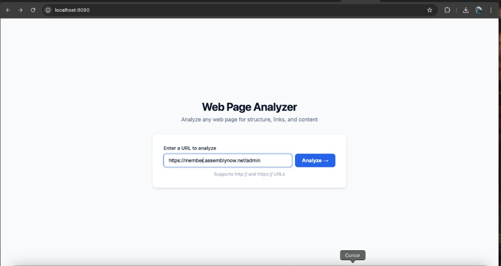
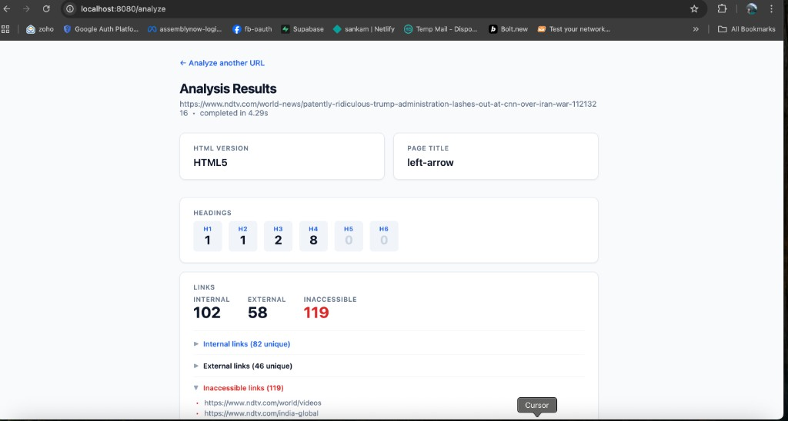

# Golang Web Application Analyzer

A server-rendered Go web application that analyzes any web page and returns a structured report covering HTML version, page title, heading structure, link statistics, and login form detection.

---

## Table of Contents

- [Project Overview](#project-overview)
- [Diagrams](#diagrams)
- [Prerequisites](#prerequisites)
- [Technologies Used](#technologies-used)
- [External Dependencies](#external-dependencies)
- [Setup & Installation](#setup--installation)
- [Application Usage](#application-usage)
- [API Endpoints & Specification](#api-endpoints--specification)
- [Docker Deployment](#docker-deployment)
- [Running Tests](#running-tests)
- [Challenges & Approaches](#challenges--approaches)
- [Possible Improvements](#possible-improvements)
- [Screenshots / Demo](#screenshots--demo)

---

## Project Overview

This application accepts a URL from a user via a web form, fetches the HTML of that page, and returns a detailed analysis report. It is built as a **server-rendered** Go web application — no JavaScript framework, no frontend build step, and no separate API server. The backend performs analysis and renders HTML templates directly.

**Main capabilities:**

| Feature | Description |
|---------|-------------|
| **HTML Version** | Detects HTML5, HTML 4.01 (Strict/Transitional/Frameset), XHTML 1.0/1.1, or Unknown |
| **Page Title** | Extracts the `<title>` tag content |
| **Heading Counts** | Counts h1–h6 tags individually |
| **Link Analysis** | Counts internal vs. external links; checks all links for accessibility concurrently |
| **Login Form Detection** | Detects forms with a password field and submit action |

**Architecture:**

```
cmd/server/main.go          ← Entry point, wires all components
internal/analyzer/          ← Domain logic (HTML parsing, analysis)
internal/handler/           ← HTTP handlers (form input → analysis → HTML output)
internal/server/            ← Server bootstrap, routing, middleware
internal/metrics/           ← Prometheus metric definitions
web/templates/              ← HTML templates (index + results)
```

---

## Diagrams

### Architecture diagram



### Component diagram



### Use case diagram



### Sequence diagram



---

## Prerequisites

| Requirement | Version | Install Link |
|-------------|---------|--------------|
| **Go** | 1.22+ | [https://go.dev/dl/](https://go.dev/dl/) |
| **Docker** (optional) | Latest | [https://docs.docker.com/get-docker/](https://docs.docker.com/get-docker/) |
| **Make** (optional) | Any | Preinstalled on macOS/Linux; Windows: [Git Bash](https://git-scm.com/downloads) or WSL |

---

## Technologies Used

### Backend

| Technology | Purpose | Documentation |
|------------|---------|---------------|
| **Go** | Language & runtime | [https://go.dev/doc/](https://go.dev/doc/) |
| `golang.org/x/net/html` | HTML tokenization and tree parsing | [pkg.go.dev](https://pkg.go.dev/golang.org/x/net/html) |
| `github.com/prometheus/client_golang` | Prometheus metrics exposition | [pkg.go.dev](https://pkg.go.dev/github.com/prometheus/client_golang) |
| `log/slog` | Structured JSON logging (stdlib) | [pkg.go.dev](https://pkg.go.dev/log/slog) |
| `net/http` | HTTP server and client | [pkg.go.dev](https://pkg.go.dev/net/http) |
| `html/template` | Server-side HTML rendering | [pkg.go.dev](https://pkg.go.dev/html/template) |
| `net/http/pprof` | Runtime profiling | [pkg.go.dev](https://pkg.go.dev/net/http/pprof) |
| `regexp`, `net/url` | URL validation | [pkg.go.dev](https://pkg.go.dev/regexp), [pkg.go.dev](https://pkg.go.dev/net/url) |

### Frontend

| Technology | Purpose |
|------------|---------|
| **HTML5** | Semantics, form elements, `type="url"` input |
| **Go `html/template`** | Server-side rendering of `index.html` and `result.html` |
| **Inline CSS** | Styling only; no external CSS framework |
| **No JavaScript** | Pure HTML form submission; no SPA or client-side logic |

### DevOps

| Technology | Purpose | Documentation |
|------------|---------|---------------|
| **Docker** | Multi-stage build, Alpine-based runtime image | [https://docs.docker.com/](https://docs.docker.com/) |
| **Docker Compose** | Local orchestration | [https://docs.docker.com/compose/](https://docs.docker.com/compose/) |
| **Makefile** | Build, run, test, coverage, Docker targets | — |

### Field Validation

| Layer | Implementation |
|-------|----------------|
| **Format** | `regexp.MustCompile(\`^https?://[^\s/$.?#].[^\s]*$\`)` — ensures http/https prefix and valid-looking URL |
| **Structure** | `url.ParseRequestURI` — validates parsing and path structure |
| **Scheme** | Explicit check — must be `http` or `https` (rejects `ftp`, `javascript`, etc.) |
| **Client-side hint** | HTML5 `type="url"` input for browser UX; server performs authoritative validation |

---

## External Dependencies

### Direct dependencies (via `go.mod`)

| Package | Version | Purpose |
|---------|---------|---------|
| `github.com/prometheus/client_golang` | v1.19.0 | Prometheus metrics |
| `golang.org/x/net` | v0.22.0 | HTML parsing |

### Installing dependencies

```bash
go mod download
```

Transitive dependencies are resolved automatically by Go modules. No manual installation of external tools or system libraries is required.

---

## Setup & Installation

### 1. Clone the repository

```bash
git clone https://github.com/sanka/golang-web-application-analyzer.git
cd golang-web-application-analyzer
```

### 2. Install Go dependencies

```bash
go mod download
```

### 3. Run the application

```bash
# Option A: Using Make
make run

# Option B: Direct run
go run ./cmd/server

# Option C: Build then run
make build
./bin/server
```

The server starts at **http://localhost:8080** by default.

### 4. Use a different port

```bash
PORT=9090 make run
# or
PORT=9090 go run ./cmd/server
```

### 5. Verify it is running

```bash
curl http://localhost:8080/
curl http://localhost:8080/metrics
```

---

## Application Usage

### Main functionalities

| Functionality | Role in the application |
|---------------|-------------------------|
| **URL input** | User submits a URL via the form on the index page |
| **URL validation** | Server validates format, structure, and scheme before fetching |
| **Analysis** | Fetches HTML, parses it, runs analysis functions (version, title, headings, links, login form) |
| **Result rendering** | Displays analysis in a structured result page |
| **Error handling** | All errors surface as user-facing messages on the index page (HTTP 200) |
| **Logging** | Structured JSON logs to stdout (method, path, status, duration) |
| **Metrics** | Prometheus counters and histograms at `/metrics` |
| **Profiling** | pprof endpoints at `/debug/pprof/` for CPU, heap, goroutines |

### Logging

- **Format:** Structured JSON to stdout
- **Fields:** `method`, `path`, `status`, `duration_ms`, `remote_addr`
- **Levels:** Info for requests; Warn for target 4xx/5xx and inaccessible links; Error for fetch/parse failures

### Error handling

| Situation | User message | HTTP status |
|-----------|--------------|-------------|
| Empty URL | `URL is required` | 200 |
| Invalid format | `Invalid URL format: "<value>"` | 200 |
| Non-http/https scheme | `URL scheme must be http or https, got "ftp"` | 200 |
| DNS / network failure | `URL is not reachable: <error>` | 200 |
| HTTP 4xx from target | `HTTP 404: Not Found` | 200 |
| HTTP 5xx from target | `HTTP 503: Service Unavailable` | 200 |
| Parse failure | `Failed to parse page content.` | 200 |
| Template render failure | `Internal server error` | 500 |

### Authentication

This application does **not** implement authentication. It is intended for local or internal use. See [Possible Improvements](#possible-improvements) for adding auth.

---

## API Endpoints & Specification

This is a form-based web application. The endpoints below serve as the **API specification**. There is no separate OpenAPI/Swagger document.

| Method | Path | Description |
|--------|------|-------------|
| `GET` | `/` | Serve the URL input form |
| `POST` | `/analyze` | Accept `url` (form), run analysis, render results or error |
| `GET` | `/metrics` | Prometheus metrics |
| `GET` | `/debug/pprof/` | pprof profiling index |
| `GET` | `/debug/pprof/heap` | Heap profile |
| `GET` | `/debug/pprof/goroutine` | Goroutine profile |

### POST /analyze

- **Content-Type:** `application/x-www-form-urlencoded`
- **Field:** `url` (required) — target URL (http/https only)
- **Success:** HTTP 200, result page rendered
- **Error:** HTTP 200, index page re-rendered with error message

---

## Docker Deployment

### Build image

```bash
make docker-build
# Equivalent: docker build -t golang-web-analyzer .
```

### Run container

```bash
make docker-run
# Equivalent: docker run --rm -p 8080:8080 golang-web-analyzer
```

### Docker Compose

```bash
docker-compose up
```

The app is available at **http://localhost:8080**. The image uses a non-root user and includes a healthcheck.

---

## Running Tests

```bash
make test
# Equivalent: go test ./... -v -race -count=1
```

The `-race` flag enables Go's race detector.

### Coverage

```bash
make coverage
# Produces coverage.out and coverage.html
```

Open `coverage.html` for a line-by-line report.

### Test strategy

- **Unit tests:** Table-driven tests for analyzer and handler; `httptest.NewServer` for HTTP, no external calls
- **Integration:** Not automated; architecture supports spinning up the server with `httptest` and validating full flows

---

## Challenges & Approaches

| Challenge | Approach |
|-----------|----------|
| **Concurrent link checking** | `sync.WaitGroup` for completion; buffered channel semaphore (max 10) for concurrency; `sync.Mutex` for shared result state |
| **HTML version detection** | Case-insensitive matching on raw DOCTYPE token with `strings.ToLower` and `strings.Contains` instead of brittle regex |
| **Parsing body twice** | Buffer response into `[]byte` once; use `bytes.NewReader` for DOCTYPE detection and `html.Parse` separately |
| **Ordered heading display** | Custom `list` template function returning fixed-order `[]string{"h1",…,"h6"}` because Go maps iterate non-deterministically |
| **Inaccessible link definition** | HTTP status ≥ 400 or any network/DNS/timeout error |
| **Internal vs external links** | Same host (including subdomain) = internal; different host = external |

---

## Possible Improvements

- **Result caching** — Cache by URL with TTL (e.g. Redis or in-memory) to avoid repeated fetches
- **Rate limiting** — Per-IP limits to prevent abuse
- **Async processing** — Submit URL → job ID → poll for completion for pages with many links
- **JavaScript-rendered pages** — Use headless browser (e.g. `chromedp`) for SPAs
- **Login form heuristics** — Add checks for username/email fields, OAuth buttons, etc.
- **Result export** — Download analysis as JSON, CSV, or PDF
- **Configurable timeouts** — Expose `FETCH_TIMEOUT`, `LINK_CHECK_TIMEOUT` via env vars
- **Recursive crawling** — Optional site-wide report by following internal links
- **Authentication** — Basic auth or OAuth to protect the analyzer
- **Dark mode** — Use `prefers-color-scheme` in CSS

---

## Screenshots / Demo

### Index — URL input form



Enter a URL and click **Analyze** to run the analysis.

### Results — analysis output



Results include HTML version, page title, heading counts, link statistics (internal, external, inaccessible), and login form detection.

---

## Note on Implementation

This project was developed manually according to specified requirements. Code was written to satisfy functional and non-functional needs.
